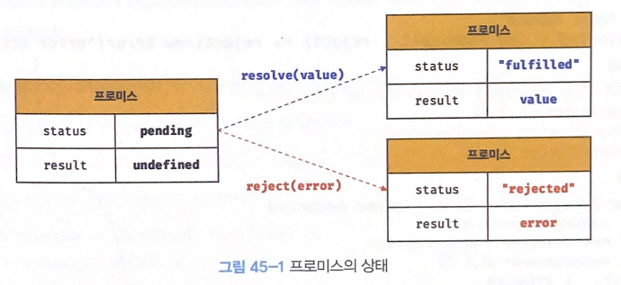

# 프로미스

자바스크립트는 비동기 처리를 위한 하나의 패턴으로 콜백함수를 사용한다. 하지만 콜백 패턴은 콜백 헬로 인해 **가독성이 나쁘고** 비동기 처리 중 발생한 **에러 처리가 곤란**하며, **여러 개의 비동기 처리를 한 번에 처리하는 데도 한계**가 있다.

ES6에서 비동기 처리를 위한 프로미스를 도입했다.

## 1. 비동기 처리를 위한 콜백 패턴의 단점

### 1.1 콜백 헬

```js
let todos;

const get = (url) => {
  const xhr = new XMLHttpRequest();
  xhr.open("GET", url);
  xhr.send();

  xhr.onload = () => {
    if (xhr.status === 200) {
      todos = JSON.parse(xhr.response);
    } else {
      console.error(`${xhr.status} ${xhr.statusText}`);
    }
  };
};

get("https://jsonplaceholder.typicode.com/post/1");
console.log(todos); // undefined
```

위처럼 비동기 함수는 비동기 처리 결과를 외부에 반환할 수 없고, 상위 스코프의 변수에 할당할 수도 없다. 따라서 비동기 함수의 처리 결과에 대한 후속 처리는 비동기 함수 내부에서 해야한다. 이때 후속 처리를 위한 콜백 함수를 전달하는 것이 일반적이다. 필요에 따라 비동기 처리가 성공하면 호출될 콜백 함수와 비동기 처리가 실패하면 호출될 콜백 함수를 전달할 수 있다.

이때 콜백 함수를 통해 비동기 처리 결과에 대한 후속 처리를 수행하는 비동기 함수가 비동기 처리 결과를 가지고 또 다시 비동기 함수를 호출해야 할 경우 콜백 함수 호출이 중첩되어 복잡도가 높아지는 현상이 발생하는데, **콜백 헬**이라 한다.

```js
get(`${url}/post/1`, ({ userId }) => {
  get(`${url}/users/${userId}`, (userInfo) => {
    console.log(userInfo);
  });
});
```

### 1.2 에러 처리의 한계

```js
try {
  setTimeout(() => {
    throw new Error("Error");
  }, 1000);
} catch (e) {
  console.error("캐치한 에러", e);
}
```

try 코드 블록 내 호출한 setTimeout은 1초 뒤에 콜백 함수가 실행된다. 이때 catch에서 에러가 캐치되지 않는다. 그 이유는 비동기 함수인 setTimeout이 호출되면 setTimeout 함수의 실행 컨텍스트가 생성되어 콜 스택에 푸시되어 실행된다. setTimeout 함수는 비동기 함수이기 때문에 콜백 함수가 바로 실행되지 않고 즉시 종료되어 콜 스택에서 제거된다.

이후 타이머가 만료되면 콜백 함수는 태스크 큐로 푸시되고 콜 스택이 비어있다면 이벤트 루프에 의해 콜 스택으로 푸시되어 실행된다.

setTimeout 함수의 콜백 함수가 실행될 때는 이미 setTimeout은 콜 스택에서 제거된 상태다. 이것은 setTimeout 의 콜백 함수를 호출한 것이 setTimeout이 아니라는 뜻이다. setTimeout 함수의 콜백 함수의 호출자(caller)가 setTimeout 함수라면 하위 실행 컨텍스트가 setTimeout 이여야 한다.

이처럼 콜백 헬이나 에러 처리가 곤란하다는 문제를 극복하기 위해 프로미스가 도입되었다.

## 2. 프로미스 생성

Promise 생성자 함수는 비동기 처리를 수행할 콜백 함수를 인수로 전달받는데, 이 콜백 함수는 resolve와 reject 함수를 인수로 받는다. 비동기 처리가 성공하면 resolve 함수에 처리 결과를 인수로 전달하면서 호출하고, 실패하면 에러를 reject 함수에 인수로 전달하면서 호출한다.

프로미스는 다음과 같이 현재 비동기 처리가 어떻게 진행되고 있는지를 나타내는 상태 정보를 갖는다.

| 프로미스의 상태 정보 | 의미                                  | 상태 변경 조건                   |
| -------------------- | ------------------------------------- | -------------------------------- |
| pending              | 비동기 처리가 아직 수행되지 않은 상태 | 프로미스가 생성된 직후 기본 상태 |
| fulfilled            | 비동기 처리가 수행되고 성공한 상태    | resolve 함수 호출                |
| rejected             | 비동기 처리가 수행되고 실패한 상태    | reject 함수 호출                 |

- 비동기 처리 성공: resolve 함수를 호출해 프로미스를 fulfilled 상태로 변경한다.
- 비동기 처리 실패: reject 함수를 호출해 프로미스를 rejected 상태로 변경한다.

이처럼 **프로미스의 상태는 resolve 또는 reject 함수를 호출하는 것으로 결정된다.**



fulfilled 또는 rejected 상태를 settled 상태라고 한다. settled 상태는 pending이 아닌 상태인 비동기 처리가 수행된 상태를 말한다.

프로미스는 pending 상태에서 settled 상태로 변하면 더는 다른 상태로 변화할 수 없다.

프로미스는 비동기 처리 상태와 더불어 비동기 처리 결과도 상태로 갖는다. (위 그림 참고)

**즉, 프로미스는 비동기 처리 상태와 처리 결과를 관리하는 객체다.**

## 3. 프로미스의 후속 처리 메서드

프로미스는 비동기 처리 상태가 변화하면 이에 따른 후속 처리를 해야 한다. 이를 위해 프로미스는 후속 메서드 `then, catch, finally`를 제공한다.
이때 후속 처리 메서드의 콜백 함수에 프로미스의 처리 결과가 인수로 전달된다.

### 3.1 Promise.prototype.then

then 메서드는 두 개의 콜백 함수를 인수로 받는다.

- 첫번째 콜백 함수: 프로미스가 fulfilled 상태가 되면 호출된다.
- 두번째 콜백 함수: 프로미스가 rejected 상태가 되면 호출된다.

then 메서드는 언제나 프로미스를 반환한다. 콜백 함수가 프로미스가 아닌 값을 반환하면 그 값을 암묵적으로 resolve 또는 reject하여 프로미스를 생성해 반환한다.

### 3.2 Promise.prototype.catch

catch 메서드는 한 개의 콜백 함수를 인수로 받는다. catch 메서드의 콜백 함수는 프로미스가 rejected 상태인 경우에만 호출된다.
then과 마찬가지로 언제나 프로미스를 반환한다.

catch 메서드를 호출하면 내부적으로 `then(undefined, onRejected)`을 호출한다.

```js
get(wrongUrl)
  .then((res) => {
    console.log(res);
  })
  .then(undefined, (err) => {
    console.error(err);
  });
```

### 3.3 Promise.prototype.finally

finally 메서드는 한 개의 콜백 함수를 인수로 받는다. finally 메서드의 콜백 함수는 프로미스의 성공/실패 여부에 상관없이 무조건 한번 호출된다. 마찬가지로 언제나 프로미스를 반환한다.

## 4. 프로미스 체이닝

then, catch, finally 메서드는 언제나 프로미스를 반환하므로 연속적으로 호출할 수 있다. 이를 프로미스 체이닝이라 한다.

다만, 프로미스도 콜백 패턴을 사용하므로 콜백 함수를 사용하지 않는 것은 아니다. 콜백 패턴은 가독성이 좋지 않으므로 ES8에서 async/await을 도입했다.
async/await를 사용하면 후속 처리 메서드 없이 마치 동기 처리처럼 프로미스가 처리 결과를 반환하도록 구현할 수 있다.

[async/await 자세히 보기]()

## 5. 프로미스의 정적 메서드

### 5.1 Promise.resolve / Promise.reject

Promise.resolve / Promise.reject 메서드는 이미 존재하는 값을 래핑하여 프로미스를 생성하기 위해 사용한다.

```js
const resolvedPromise = Promise.resolve([1, 2, 3]);
resolvedPromise.then(console.log); // console.log의 인수로 [1, 2, 3]이 들어옴
```

### 5.2 Promise.all

여러 개의 비동기 처리를 모두 병렬 처리할 때 사용한다.

```js
const requestData1 = () =>
  new Promise((resolve) => setTimeout(() => resolve(1), 3000));
const requestData2 = () =>
  new Promise((resolve) => setTimeout(() => resolve(2), 2000));
const requestData3 = () =>
  new Promise((resolve) => setTimeout(() => resolve(3), 1000));

Promise.all([requestData1, requestData2, requestData3])
  .then(console.log) // [1, 2, 3] => 약 3초 소요
  .catch(console.error);
```

전달받은 모든 프로미스가 모두 fulfilled 상태가 되면 모든 처리 결과를 배열에 저장해 새로운 프로미스를 반환한다.

- 첫번째 프로미스는 3초 후에 1을 resolve 함
- 두번째 프로미스는 2초 후에 2을 resolve 함
- 세번째 프로미스는 1초 후에 3을 resolve 함

Promise.all은 인수로 전달받은 배열의 모든 프로미스가 fulfilled 상태가 되면 종료한다. 따라서, 종료하는 데 걸리는 시간은 가장 늦게 fulfilled 상태가 된 3초보다 조금 더 길다.
이때 첫번째 프로미스가 가장 나중에 fulfilled 되어도 차례대로 배열에 저장해 그 배열을 resolve하는 새로운 프로미스를 반환한다.

이때 프로미스가 하나라도 rejected 상태가 되면 나머지 프로미스를 기다리지 않고 즉시 종료한다.

```js
const requestData1 = () =>
  new Promise((_, reject) =>
    setTimeout(() => reject(new Error("Error 1")), 3000)
  );
const requestData2 = () =>
  new Promise((_, reject) =>
    setTimeout(() => reject(new Error("Error 2")), 2000)
  );
const requestData3 = () =>
  new Promise((_, reject) =>
    setTimeout(() => reject(new Error("Error 3")), 1000)
  );

Promise.all([requestData1, requestData2, requestData3])
  .then(console.log)
  .catch(console.error); // Error: Error 3
```

만약 인수로 전달받은 이터러블의 요소가 프로미스가 아니라면 Promise.resolve로 래핑해준다.

```js
Promise.all([
  1, // -> Promise.resolve(1)
  2, // -> Promise.resolve(2)
  3, // -> Promise.resolve(3)
])
  .then(console.log) // [1, 2, 3]
  .catch(console.error);
```
